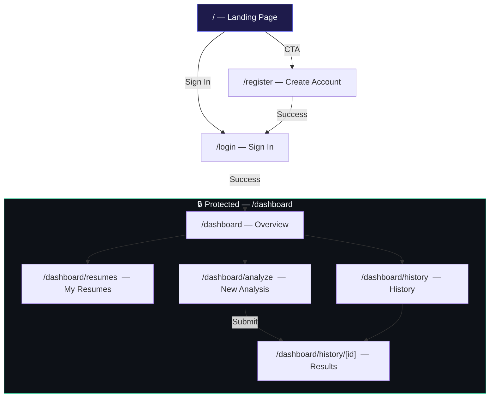
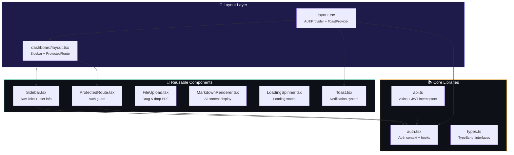
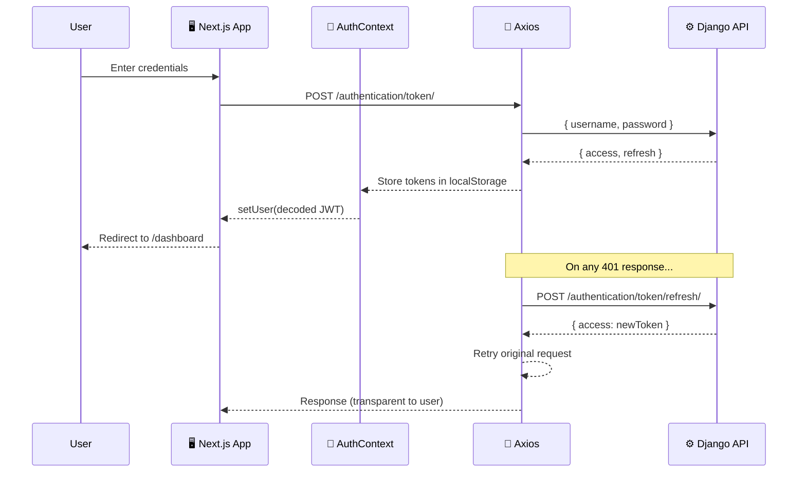

<p align="center">
  
  
  
  
</p>

<h1 align="center">🖥️ ResumeATS — Frontend</h1>

<p align="center">
  <strong>A premium, interactive dark-mode UI built with Next.js 16, React 19, and TypeScript.</strong>
</p>

<p align="center">
  
  
  
  
  
</p>

---

## ✨ Highlights

<table>
<tr>
<td width="50%">

### 🎨 Design System
- 🌙 **Dark-mode** with deep navy backgrounds
- 💎 **Glassmorphism** — frosted glass cards with `backdrop-filter`
- 🎭 **Micro-animations** — hover transforms, pulse badges, slide-in toasts
- 🫧 **Floating orbs** — animated gradient background elements
- ✨ **Ripple buttons** — Material-style interaction feedback
- 📱 **Fully responsive** — mobile-first with hamburger sidebar

</td>
<td width="50%">

### ⚡ Technical
- 🔐 **JWT Auth** with silent token refresh via Axios interceptors
- 📡 **Auto-polling** — detail page polls API until results arrive
- 📎 **Drag-and-drop** PDF upload with file preview
- 📋 **Copy to clipboard** — one-click copy for generated content
- 💾 **Download** — export resume/cover letter as text files
- 🔒 **Protected routes** — auth guard with redirect

</td>
</tr>
</table>

---

## 🗺️ Pages & Routes



| Route | Page | Key Features |
|-------|------|-------------|
| `/` | **Landing** | Hero with gradient text, floating orbs, feature cards, CTA buttons |
| `/login` | **Sign In** | Glass-card form, validation, loading spinner, error display |
| `/register` | **Create Account** | Password confirmation, strength validation, instant feedback |
| `/dashboard` | **Overview** | Stats grid (4 cards), quick action links, recent analyses table |
| `/dashboard/resumes` | **My Resumes** | Drag-drop upload, resume cards grid, view/delete actions |
| `/dashboard/analyze` | **New Analysis** | 3-step form, resume selector, JD textarea, cover letter toggle |
| `/dashboard/history` | **History** | Analysis list with status badges, timestamps, click-through |
| `/dashboard/history/[id]` | **Results** | Auto-polling, tabbed viewer, markdown rendering, copy & download |

---

## 🏗️ Component Architecture



---

## 📁 Directory Structure

```
frontend/
├── src/
│   ├── 📂 app/                          # Next.js App Router
│   │   ├── globals.css                  # 🎨 Full design system (900+ lines)
│   │   ├── layout.tsx                   # Root layout + providers
│   │   ├── page.tsx                     # Landing page
│   │   ├── 📂 login/
│   │   │   └── page.tsx                 # JWT login form
│   │   ├── 📂 register/
│   │   │   └── page.tsx                 # Registration form
│   │   └── 📂 dashboard/
│   │       ├── layout.tsx               # Dashboard shell (sidebar + guard)
│   │       ├── page.tsx                 # Overview + stats
│   │       ├── 📂 resumes/
│   │       │   └── page.tsx             # Resume upload & management
│   │       ├── 📂 analyze/
│   │       │   └── page.tsx             # New analysis multi-step form
│   │       └── 📂 history/
│   │           ├── page.tsx             # Analysis history list
│   │           └── 📂 [id]/
│   │               └── page.tsx         # Analysis result viewer
│   │
│   ├── 📂 components/                   # Reusable UI components
│   │   ├── Sidebar.tsx                  # Dashboard sidebar navigation
│   │   ├── Toast.tsx                    # Toast notification context + UI
│   │   ├── FileUpload.tsx               # Drag-and-drop PDF uploader
│   │   ├── MarkdownRenderer.tsx         # AI content renderer
│   │   ├── LoadingSpinner.tsx           # Spinner (full + inline)
│   │   └── ProtectedRoute.tsx           # Auth guard with redirect
│   │
│   └── 📂 lib/                          # Core utilities
│       ├── api.ts                       # Axios instance + JWT interceptors
│       ├── auth.tsx                     # AuthContext + useAuth hook
│       └── types.ts                     # TypeScript interfaces
│
├── .env.local                           # API URL config
├── next.config.ts                       # Next.js config
├── tsconfig.json                        # TypeScript config
└── package.json                         # Dependencies
```

---

## 🎨 Design System

The entire UI is powered by a **custom CSS design system** — no Tailwind, no Bootstrap, no UI library. Just clean, handcrafted CSS.

### Color Palette

| Token | Value | Usage |
|-------|-------|-------|
| `--bg-primary` | `#060a13` | Page background |
| `--bg-glass` | `rgba(15,23,42,0.45)` | Glass cards |
| `--accent-primary` | `#6366f1` | Buttons, links, active states |
| `--accent-secondary` | `#8b5cf6` | Gradient endpoints |
| `--text-primary` | `#f1f5f9` | Main text |
| `--text-secondary` | `#94a3b8` | Secondary text |
| `--success` | `#10b981` | Success states |
| `--error` | `#f43f5e` | Error states |
| `--warning` | `#f59e0b` | Warning / processing |

### Animations

| Animation | Duration | Usage |
|-----------|----------|-------|
| `fadeInUp` | 0.5s | Page transitions |
| `spin` | 0.8s ∞ | Loading spinners |
| `pulse` | 2s ∞ | Status badge dots |
| `toastSlideIn/Out` | 0.3s | Toast notifications |
| `bgFloat` | 30s ∞ | Background gradients |
| `orbFloat1/2/3` | 18-25s ∞ | Landing page orbs |
| `btn:active ripple` | 0.5s | Button press feedback |

### Glassmorphism Recipe

```css
.glass-card {
  background: rgba(15, 23, 42, 0.45);
  backdrop-filter: blur(20px);
  border: 1px solid rgba(148, 163, 184, 0.1);
  border-radius: 16px;
}

.glass-card:hover {
  border-color: rgba(99, 102, 241, 0.3);
  box-shadow: 0 0 30px rgba(99, 102, 241, 0.15);
  transform: translateY(-2px);
}
```

---

## 🔐 Authentication Flow



---

## 🚀 Getting Started

### Prerequisites

```
node >= 18
npm >= 9
```

### Install & Run

```bash
# Install dependencies
npm install

# Start dev server
npm run dev
```

🌐 Open **http://localhost:3000**

> ⚠️ Make sure the Django backend is running on `http://localhost:8000` (or update `.env.local`)

### Build for Production

```bash
npm run build     # TypeScript check + production build
npm start         # Serve production build
```

---

## 🔑 Environment Variables

| Variable | Default | Description |
|----------|---------|-------------|
| `NEXT_PUBLIC_API_URL` | `http://localhost:8000` | Django backend API URL |

---

## 📊 Build Output

```
Route (app)
┌ ○ /                        → Landing page (static)
├ ○ /login                   → Sign in (static)
├ ○ /register                → Create account (static)
├ ○ /dashboard               → Overview (static shell)
├ ○ /dashboard/analyze       → New analysis form
├ ○ /dashboard/history       → Analysis history
├ ƒ /dashboard/history/[id]  → Analysis detail (dynamic)
└ ○ /dashboard/resumes       → Resume management

○ Static    ƒ Dynamic
✅ Zero TypeScript errors
✅ Compiled successfully
```

---

## 📦 Dependencies

| Package | Version | Purpose |
|---------|---------|---------|
| `next` | 16.3.5 | React framework (App Router) |
| `react` | 19.2.8 | UI library |
| `react-dom` | 19.2.8 | DOM rendering |
| `axios` | latest | HTTP client with interceptors |
| `typescript` | 5.x | Type safety |

> 💡 **Zero UI libraries.** No Tailwind, no Bootstrap, no shadcn/ui. The entire design system is custom vanilla CSS — demonstrating deep CSS expertise and attention to design.

---

## 🧪 Key Technical Decisions

<details>
<summary><strong>🤔 Why vanilla CSS instead of Tailwind?</strong></summary>

To demonstrate deep understanding of CSS fundamentals — custom properties, glassmorphism, keyframe animations, responsive design, and a complete design token system. This showcases the ability to build design systems from scratch, not just apply utility classes.

</details>

<details>
<summary><strong>🤔 Why App Router instead of Pages Router?</strong></summary>

Next.js App Router is the recommended architecture for new projects. It enables React Server Components, nested layouts, and co-located loading/error states. The dashboard layout pattern with shared sidebar is a natural fit for nested routing.

</details>

<details>
<summary><strong>🤔 Why manual JWT handling instead of NextAuth?</strong></summary>

The Django backend uses SimpleJWT with a custom token endpoint. Rolling our own auth context gives us full control over token lifecycle, silent refresh, and decode — without the overhead of a third-party auth library. It also demonstrates understanding of JWT mechanics.

</details>

<details>
<summary><strong>🤔 Why auto-polling instead of WebSockets?</strong></summary>

The backend uses Celery for async processing and doesn't have a WebSocket layer. Polling every 5 seconds is simple, reliable, and appropriate for the expected latency (15-30s). It avoids the complexity of adding Django Channels while providing a good UX with automatic result detection.

</details>

---

## 🖼️ Page Descriptions

<details>
<summary><strong>🏠 Landing Page</strong></summary>

- Full-viewport hero section with animated gradient text
- Three floating orbs with independent animation cycles
- Feature cards with glassmorphism hover effects
- Responsive CTA buttons with conditional auth-aware links
- Badge with "Powered by Gemini AI" callout

</details>

<details>
<summary><strong>🔐 Login / Register</strong></summary>

- Centered glass-card forms with animated orb backgrounds
- Inline validation and error display
- Loading spinner inside submit button during API call
- Auto-redirect on success with toast notification
- Password confirmation on register page

</details>

<details>
<summary><strong>📊 Dashboard Overview</strong></summary>

- 4-card stats grid: Resumes, Completed, Processing, Cover Letters
- Quick action cards with hover animations
- Recent analyses table with status badges (pulse dot animation)
- Click-through links to all dashboard sections

</details>

<details>
<summary><strong>📄 Resume Management</strong></summary>

- Toggle-able upload section with drag-and-drop zone
- File type filtering (PDF only)
- Selected file preview with name and size
- Resume cards grid with view (opens in new tab) and delete actions
- Empty state with CTA when no resumes exist

</details>

<details>
<summary><strong>✨ New Analysis</strong></summary>

- 3-step progress indicator with active/completed states
- Dropdown resume selector pulling from user's uploads
- Large textarea for job description input
- Custom toggle switch for cover letter generation
- Full form validation with toast error messages

</details>

<details>
<summary><strong>📋 Analysis Detail</strong></summary>

- Auto-polls API every 5 seconds until results arrive
- Animated spinner with helpful text during processing
- Tabbed content viewer (Resume / Cover Letter tabs)
- Markdown renderer for structured AI output
- One-click copy to clipboard with toast confirmation
- Download as .txt file button

</details>

---

<p align="center">
  <sub>Part of the <strong><a href="../README.md">ResumeATS</a></strong> project</sub>
</p>
